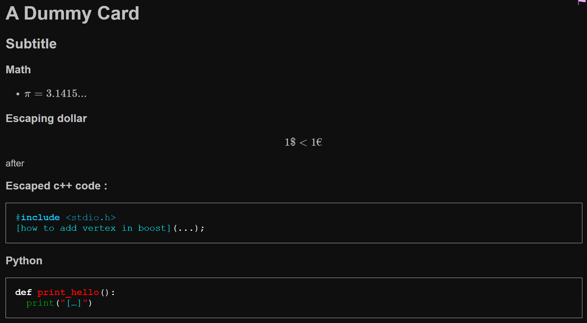
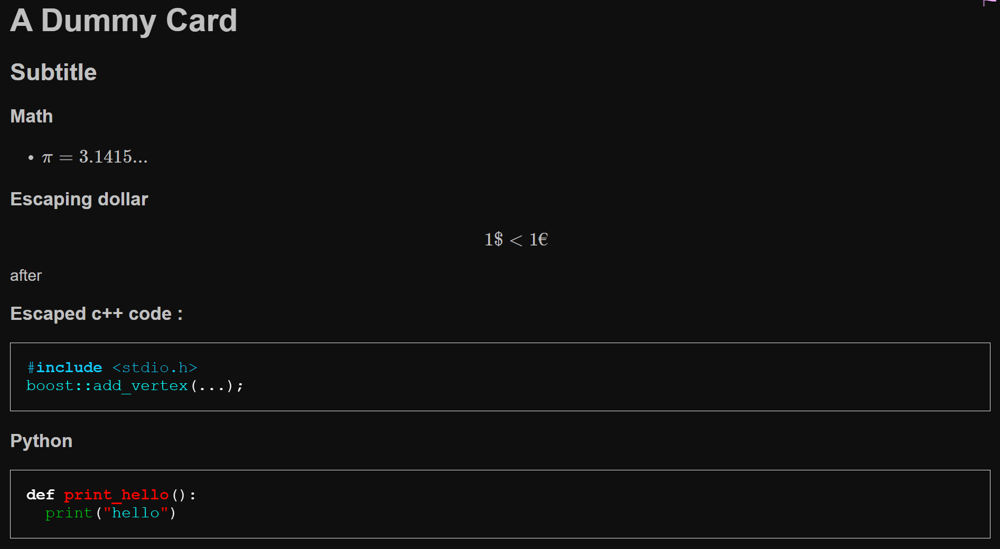
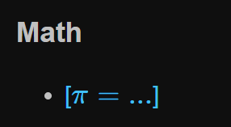
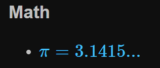
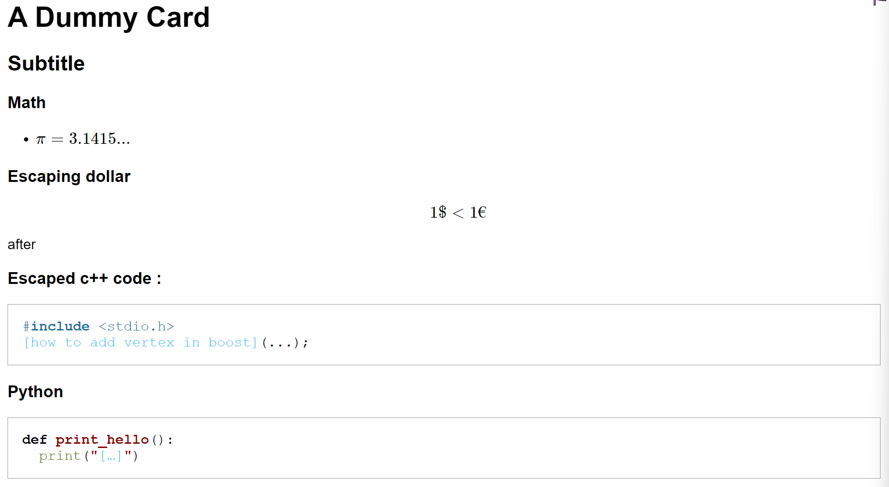

# Anki Markdown


Adding support and improvements of how cards are displayed.
Allowing for clozes inside code blocks. Better night mode support & readability. Coloring of the cloze elements. 

Creates a new Basic and a new Cloze Note Type that support Markdown and KaTeX: *Markdown and KaTeX Basic (Color)* and *Markdown and KaTeX Cloze (Color)*.

The following can be used to create a sample cloze card (remove the "\" before the backticks).

```md
# A Dummy Card
## Subtitle
### Math
- {{c1::$\pi=3.1415...$::$\pi=...$}}
### Escaping dollar
$$1\$ < 1€ $$ after

### Escaped c++ code :

\```cpp
#include <stdio.h>
{{c2::boost\:\:add_vertex::how to add vertex in boost}}(...);
\```

### Python

\```py
def print_hello():
  print("{{c2::hello}}")
\```
```








## Features

- <a href="https://www.intmath.com/cg5/katex-mathjax-comparison.php" rel="nofollow">KaTeX is considered way faster than MathJax</a>
- Works on any device as long as there is internet connection
- <a href="https://markdown-it.github.io/" rel="nofollow">Markdown is a great all in one solution for Anki cards</a>
- Access KaTeX by <code>$...$</code> for inline math or <code>$$...$$</code> for displaystyle math, a list of supported functions can be found <a href="https://katex.org/docs/supported.html" rel="nofollow">here</a> 
- MathJax can also be accessed via <code>\[ ... \]</code> and <code>\(...\)</code>
- Escape `\$` and `\:`
- colored cloze cards
- support for dark mode


## Used Libraries
<a href="https://github.com/markdown-it/markdown-it">Markdown-It</a>  
<a href="https://github.com/KaTeX/KaTeX">KaTeX</a>

## Installation
* Go to
<a href="https://ankiweb.net/shared/info/1786114227"></a>
to see how to install this addon for anki
* To install locally download the latest [release](https://github.com/alexthillen/Anki-KaTeX-Markdown-Reworked/releases) and install by opening **Anki → Tools → Add-ons → Install** from file, then select **MDKaTeX.ankiaddon**

Fork of : https://github.com/Jwrede/Anki-KaTeX-Markdown.

Special Thanks to [Jwrede](https://github.com/Jwrede) for starting this project.
